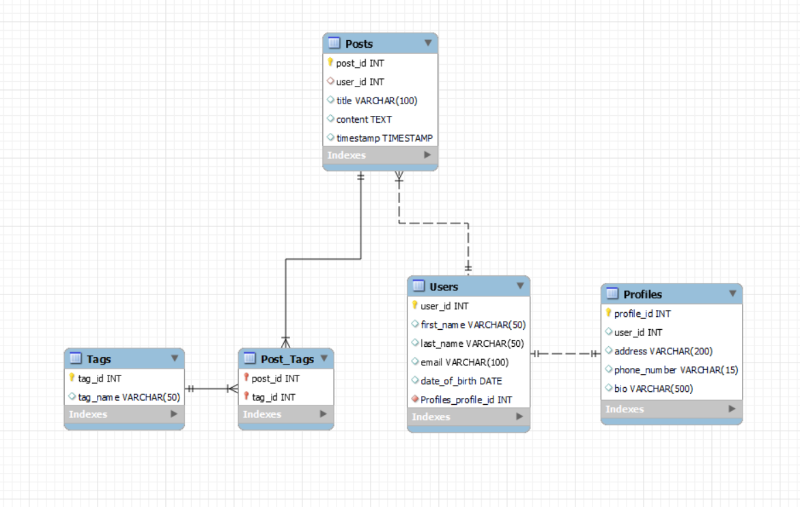

# Дипломски рад - Анализа имплементације и перформанси различитих алата за објектно-релационо мапирање 
 
Милош Гравара - RA60/2019

## Увод 

Репозиторијум намењен за реализацију дипломског рада који се бави упоредном анализом имплементације и перформанси различитих објектно-релационих мапера. 
Алати који су одабрани за анализу: _**Entity Framework**_ за програмски језик **_C#_**, **_Hibernate_** за програмски језик **_Java_**, _**SQLAlchemy**_ за програмски језик _**Python**_    
Идеја је да се истражи начин имплементације сваког од наведених алата и да се упореде њихове перформансе са основним библиотекама за комуникацију са базама података у одговарајућим програмским језицима.   
За систем за управљање базом података одабран је _**MySQL**_ због своје доступности и једноставности за коришћење и креирање базе података, као и због своје широке примене у развоју модерних информационих система. 

## Тестно окружење 

### Хардверске спецификаије 

**Процесор**: AMD Ryzen 7 5800H, 16 језгара, 3.2 GHz  
**РАМ**: 16 GB, 3200 MHz  
**Хард-диск**: Samsung PM991A M.2 512GB  

### Софтверске спецификације

**Оперативни систем**: Windows 10 Pro 64-bit   
**Систем за управљање базом података**: MySQL 8.0.34  
**Алати за објектно-релационо мапирање**: 
 - Entity Framework Core 7.0.9
 - Hibernate Core 6.2.6
 - SQLAlchemy 1.4.49

### Шема базе података

За потребе тестирања наведених алата, коришћена је шема базе података друштвене мреже. Основни ентитети који чине шему су: **Корисник**, **Профил**, **Објава** и **Таг**.
- **Корисник - _User_** представља особу која користи систем или платформу. У основи, то је налог преко кога особа приступа и користи различите услуге или функције платформе.
- **Профил - _Profile_** садржи личне и додатне податке о кориснику. То могу бити информације попут слике профила, контактних информација, биографије и других детаља који помажу у идентификацији или представљању корисника на платформи. У овој табели се налази страни кључ "корисник_ид" који директно повезује профил са конкретним корисником.
- Сваки **Корисник** има један и само један **Профил** који садржи додатне информације о њему. Профил је повезан са корисником преко страног кључа ***user_id*. Ова веза један према један осигурава да сваки корисник има јединствен профил на платформи.
- **Објава - _Post_** представља текстуални садржај који корисник дели на платформи. Свака објава има временску ознаку (тиместамп) која указује на тачно време када је објава креирана или постављена. Ова временска ознака помаже у праћењу и сортирању објава на хронолошкој основи.
- **Ознака (Таг) - _Tag_** представља кључну реч или ознаку која помаже у категоризацији и претрази садржаја. Тагови омогућавају корисницима да брзо пронађу сродне објаве или чланке на основу интересовања или теме.
- **Таг_Објава - _Post_Tag_** представљају везу између објава и одговарајућих тагова. Ова табела омогућава свакој објави да има више тагова и, истовремено, сваки таг може бити придружен више објавама. Ова веза помаже у ефикасној организацији и претрази садржаја на платформи.
Разлог због ког је одабрана ова шема базе података је да се омогући увид у механизме  објектно релационих мапера за мапирање веза између ентита шеме базе података и веза између објеката у одговарајућим програмским језицима. 
Такође, услед постојања веза између ентитета, ствара се могућност тестирања перформанси алата у реализацији комплексних упита.

### Подаци 

Табеле _**Users**_ и _**Profiles**_ попуњене су са по **80 хиљада** насумичних података, при чему је акценат био на **поштовању задатих ограничења шеме базе података**.   
Табеле _**Posts**_, _**Tags**_ i _**Posts_Tags**_ попуњене су са по приближно **100 хиљада** насумичних података и обраћена је посебна пажња да подаци буду **разноврсно распоређени** како би се створили **реални услови тестирања перформанси**. Ово се односи на чињеницу да поједини корисници платформе могу имати више објава и ознака везаних за своје објаве, док неки корисници уопште немају објаве или поједине објаве немају ознаке.

### Упити 

## Референтна литература и материјал

[1] [EFCore GitHub Repository](https://github.com/dotnet/efcore)  
[2] [Hibernate GitHub Repository](https://github.com/hibernate/hibernate-orm)  
[3] [SQLAlchemy GitHub Repository](https://github.com/sqlalchemy/sqlalchemy)  
[4] Van Zyl, Peter, et al. “SAICSIT ’06.” Comparing the Performance of Object Databases and ORM Tools, 2006, pp. 1–11  
[5] D. Colley, C. Stanier and M. Asaduzzaman, "The Impact of Object-Relational Mapping Frameworks on Relational Query Performance," 2018 International Conference 
on Computing, Electronics & Communications Engineering (iCCECE), Southend, UK, 2018, pp. 47-52, doi: 10.1109/iCCECOME.2018.8659222.  
[6] Lorenz et al. - Proceedings of the 11th International Joint Conference on Software Technologies - 2016  
[7] C. Ireland, D. Bowers, M. Newton and K. Waugh, "A Classification of Object-Relational Impedance Mismatch," 2009 First International Confernce on Advances in Databases, Knowledge, and Data Applications, Gosier, France, 2009, pp. 36-43, doi: 10.1109/DBKDA.2009.11.  
[8] Cvetkovic, Stevica & Janković, Dragan. (1970). A Comparative Study of the Features and Performance of ORM Tools in a .NET Environment. 6348. 147-158. 10.1007/978-3-642-16092-9_14.  
[9] Gruca, A., Podsiadło, P. (2014). Performance Analysis of .NET Based Object–Relational Mapping Frameworks. In: Kozielski, S., Mrozek, D., Kasprowski, P., Małysiak-Mrozek, B., Kostrzewa, D. (eds) Beyond Databases, Architectures, and Structures. BDAS 2014. Communications in Computer and Information Science, vol 424. Springer, Cham. https://doi.org/10.1007/978-3-319-06932-6_5  
[10] Połeć, M., Pitera, J., & Kozieł, G. (2022). Comparing the Performance of the Object-Relational Mapping Program-ming Frameworks Available in Java. Journal of Computer Sciences Institute, 22, 59-65. https://doi.org/10.35784/jcsi.2810  
[11] Drzazga, K., Bobel, M., & Skublewska-Paszkowska, M. (2020). Comparative analysis of selected object-relational mapping systems for the .NET platform.  
[12] Barnes, Jeffrey M., "Object-Relational Mapping as a Persistence Mechanism for Object-Oriented Applications" (2007). Mathematics, Statistics, and Computer Science Honors Projects. 6.
https://digitalcommons.macalester.edu/mathcs_honors/6  
[13] [Hibernate Documentation] (https://hibernate.org/orm/documentation/6.2/)
[14] [Entity Framework Core Documentation] (https://learn.microsoft.com/en-us/ef/core/)
[15] [SQLAlchemy Documentation] (https://docs.sqlalchemy.org/en/20/)
